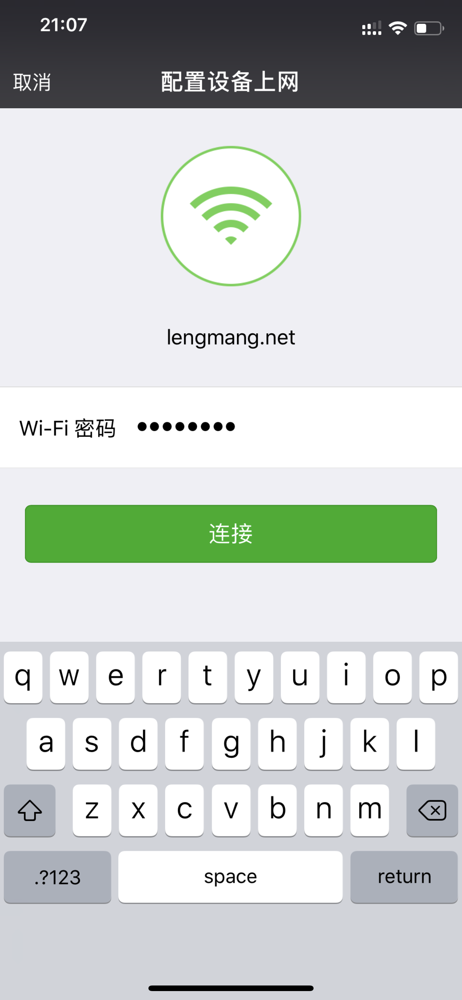
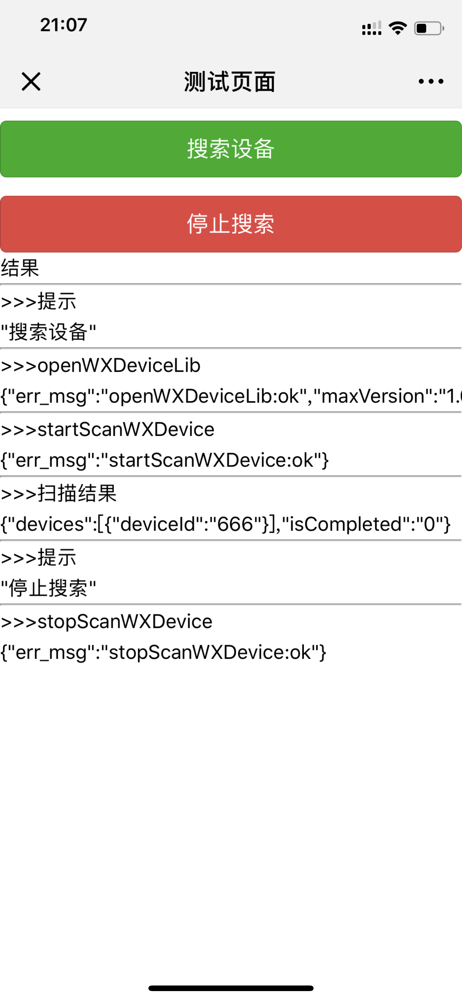
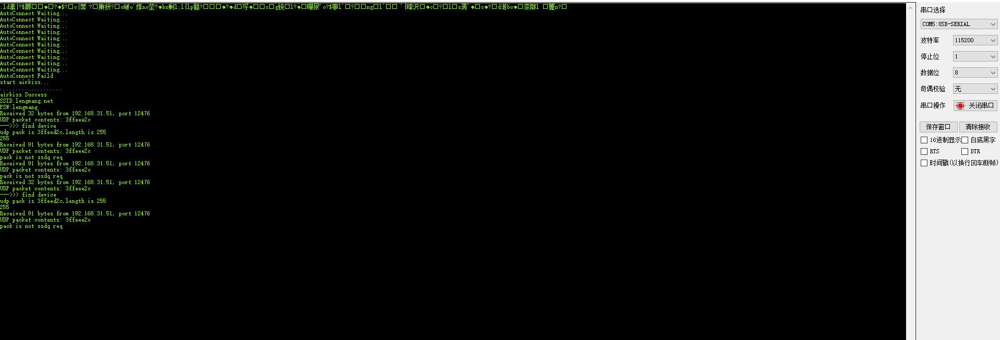

# 前言
本程序现已经支持ESP8266的微信Airkiss配网与局域网发现功能
（！！！代码与微信硬件云无关，无需去微信硬件云中生成设备id。只与微信的jssdk有关！！！）

# 技术栈
1. 基于[Arduino Esp8266](https://github.com/esp8266/Arduino)固件开发，版本2.4.2
2. 硬件NodeMCU

# 技术测试视频
http://v.youku.com/v_show/id_XNDA2Nzg5NTg4NA==.html?spm=a2h3j.8428770.3416059.1

# 技术测试截图
1. Airkiss微信页面由jssdk调起（自己写js调用微信，调起配网页面）

2. 微信NFF局域网发现（自己写js调用微信，等待微信调用js结果）

3. 调试时控制台数据

# 参考文献
1. 微信硬件云 https://iot.weixin.qq.com/wiki/new/index.html
2. 微信NFF(1) http://wiki.jackslab.org/ESP8266_AirKiss_NFF
3. 微信NFF(2) http://wiki.jackslab.org/index.php?title=ESP8266_AirKiss_NFF&diff=prev&oldid=4958
